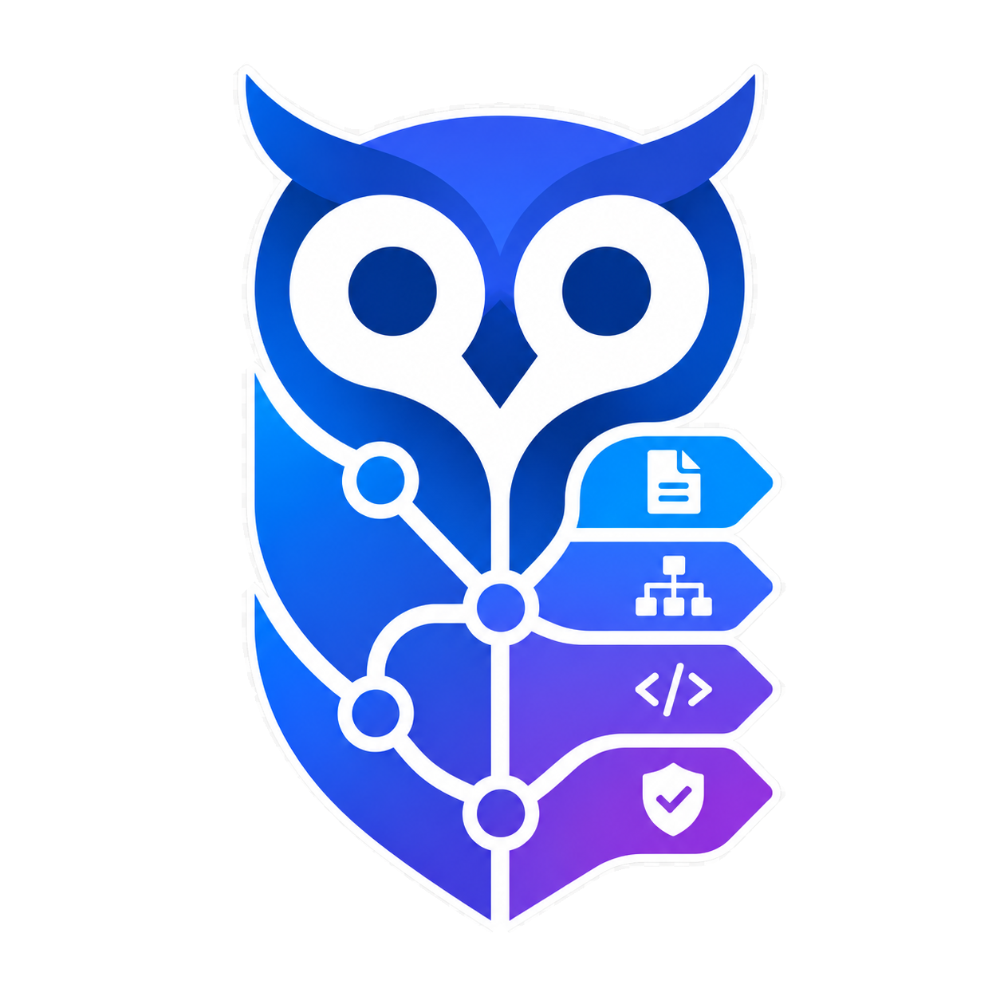

<p align="center">
  
</p>

<h1 align="center">oowl</h1>
<h3 align="center"><em>OpenCode Opinionated Workflow Layer</em></h3>

<p align="center">
  Structured multi-agent workflow for OpenCode. Cheap models route, mid models build, premium models review. File locks, approval gates, persistent design artifacts, and mandatory verification on every task.
</p>

<p align="center">
  <a href="https://github.com/jimzandueta/oowl">📖 Full documentation →</a>
</p>

<p align="center">
  <a href="https://www.npmjs.com/package/@jimzandueta/oowl"></a>
  <a href="https://github.com/jimzandueta/oowl/actions/workflows/ci.yml"></a>
  <a href="https://github.com/jimzandueta/oowl/tags"></a>
  <a href="LICENSE"></a>
  <br>
  <a href="https://opencode.ai/"></a>
  <a href="https://www.typescriptlang.org/"></a>
</p>

---

## Install

Requires [OpenCode](https://opencode.ai/) and Node.js 18+.

```bash
npx @jimzandueta/oowl install
```

The installer defaults to the `low` profile and walks you through model profile selection, then writes the framework files into your project.

## Quick start

Open OpenCode in the project and tell `dispatcher` what to build:

```text
You: "Add a login page with email/password and Google OAuth."

Dispatcher → Architect writes design.md   [you approve]
           → Planner writes implementation.md → plan-reviewer
           → [you approve the plan]
           → Builder schedules → agents implement with file locks
           → Reviewer writes review.md
           → [optional merge → done]
```

23 agents across 6 classes: orchestrators, artifact owners, implementers, reviewers, escalation, and bounded workers. Every substantial feature produces a `docs/specs/<feature>/` directory with the design, plan, and review owned by their respective agents.

## Why oowl

One agent designs, codes, and reviews in a single session. It edits files it shouldn't, makes changes you didn't approve, loses context when you scroll away, and never runs a security check unless you specifically ask. You get output fast, but you don't know what's safe without reading every diff.

oowl decomposes the work:

| Without oowl | With oowl |
|---|---|
| One agent touches anything | Each task has locked file boundaries |
| Design vanishes when chat ends | Design, plan, review persist in `docs/specs/` |
| "Looks done" is the only check | Agents run verification before reporting complete |
| Same model does everything | Profiles assign cheap / mid / premium by role |
| Security if you remember | Sensitive areas auto-escalate |
| Review if you ask | Every feature ships with a written review |

## How it works

```text
your request → dispatcher
  trivial?  → one implementer → done
  substantial?
    → optional Git feature branch
    → architect writes design.md       [you approve]
    → planner writes implementation.md [plan-reviewer validates]
    → [you approve]
    → builder schedules implementation waves
    → agents implement with file locks and verification
    → reviewer writes review.md
    → optional branch merge → done
```

**Artifacts** are the durable record of every feature. They live under `docs/specs/<feature>/`:

```text
docs/specs/login-page/
├── design.md           # architect: approach, tradeoffs, risks
├── ui-spec.md          # designer: layout, interactions (if UI involved)
├── implementation.md   # planner: task breakdown, file locks, verification
└── review.md           # reviewer: what shipped, test results, risks
```

These are owned by specific agents. Non-owners can read them but cannot edit, delete, or overwrite them.

**Tiers** map agents to three model cost levels:

| Tier | Handles | Agents |
|---|---|---|
| Cheap | Routing, scheduling, bounded work | `dispatcher`, `builder`, `low-*` |
| Mid | Design, implementation, review | `architect`, `planner`, specialists |
| Premium | Escalations, deep security | `high-*`, `security-auditor` |

Switch between bundled profiles (`low` default, `balanced`, `high`, `free`) or build a custom one from your connected models with `oowl profile`. The `free` profile uses free OpenCode models; free-data will be used in training, so do not use it for private, proprietary, regulated, customer, or confidential data.

## Commands

| Command | What it does |
|---|---|
| `oowl install` | Install the framework (interactive walkthrough) |
| `oowl init` | Configure Optional skills per project |
| `oowl profile` | Switch model profiles interactively |
| `oowl profile <name>` | Switch directly: `free`, `low`, `balanced`, `high`, `custom` |
| `oowl update` | Update framework files with conflict detection |
| `oowl --version` | Print version |

## Documentation

Workflow, agent reference, install options, model profiles, customization, common issues, and contributing guide → **[`https://github.com/jimzandueta/oowl`](https://github.com/jimzandueta/oowl)**.

## License

MIT. See [LICENSE](LICENSE).
